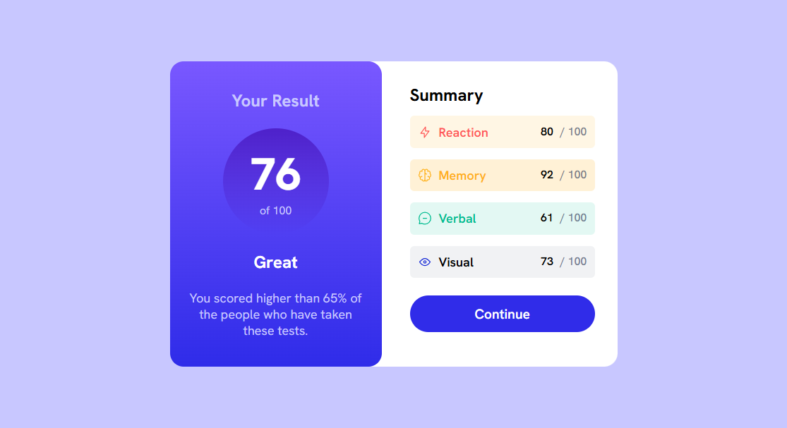

# Frontend Mentor - Results summary component solution

This is a solution to the [Results summary component challenge on Frontend Mentor](https://www.frontendmentor.io/challenges/results-summary-component-CE_K6s0maV). 

## Table of contents

- [Overview](#overview) 
  - [Screenshot](#screenshot)
  - [Links](#links)
- [My process](#my-process)
  - [Built with](#built-with)
  - [What I learned](#what-i-learned)
  - [Continued development](#continued-development) 
- [Author](#author)
- [Acknowledgments](#acknowledgments)
 

## Overview
 

### Screenshot

 

### Links

- Solution URL: [Github](https://github.com/KenawMarie/front-results-summary-component)
- Live Site URL: [Live site](https://kenawmarie.github.io/front-results-summary-component/)

## My process

### Built with

- Semantic HTML5 markup
- CSS custom properties
- Flexbox 
 

### What I learned

In this project i learned how to use the z-index and negative margins to overlap one element over the other

### Continued development

i wanna do more projects.
  

## Author

- Website - [Kenaw Marie](https://github.com/KenawMarie)
- Frontend Mentor - [@KenawMarie](https://www.frontendmentor.io/profile/KenawMarie) 
 

## Acknowledgments

I wanna say thank you to the frontend mentor for this challenge.
